*********************************************
How to Change the Wi-Fi Settings on Raspberry Pi
*********************************************

.. image:: images/finished_sg.jpg
  :alt: A finished Sensorgnome, ready to be deployed.

Introduction
============
SensorGnomes are an essential component of the `Motus Wildlife Tracking System <https://motus.org/>`_. These devices act as radio receivers in a world-wide network, listening to radio transmitters that have been deployed on birds, bats, and insects by researchers trying to answer questions about movements on multiple scales.

The SensorGnome was originally designed at the Phil Taylor Lab at Acadia University and is now available for sale by `Compudata <https://compudata.ca/sensorgnome/>`_ and `RFS Scientific <https://www.rfsscientific.com/>`_.

See `Sensorgnome.org <https://sensorgnome.org/>`_ for more information.

Connecting - OPTION 1: **Wi-Fi**
--------------------------------------------

.. youtube:: d0x9dIOvAr4

With the computer booted up, double-press the *Pushbutton* switch to activate the **Wi-Fi**.

Once active, the *Pushbutton* should blink slowly at a rate of 0.5 seconds on and 0.5 seconds off.

Using a *phone or laptop*, look for a Wi-Fi network with a name such as **"SG-###RPI3###"**, where '#' can be any letter or number.

Connect to the network using the same name of network as the password.

Once connected, open your web browser and navigate to the following address: 192.168.7.2

You should see a web page that says *'I am your SensorGnome'* with a bunch of live information about the device. A full description of the webpage will be described later. For now, the fact this page is loading will inform you that the Sensorgnome software has correctly been installed and that you have successfully connected to it.

Connecting - OPTION 2: **Ethernet Cable**
-----------------------------------------------

With the computer booted up booted up, insert the *Ethernet Cable*.
cable into the *Raspberry Pi's* **Ethernet** port and your **laptop**.

Once connected, open your web browser and navigate to the following address: **sgpi.local**

You should see a web page that says **'I am your SensorGnome'** with a bunch of live information about the device.

If you are having trouble connecting, try the previous step with Wi-Fi.

Change Wi-Fi Settings - OPTION 1: **Laptop**
--------------------------------------------------
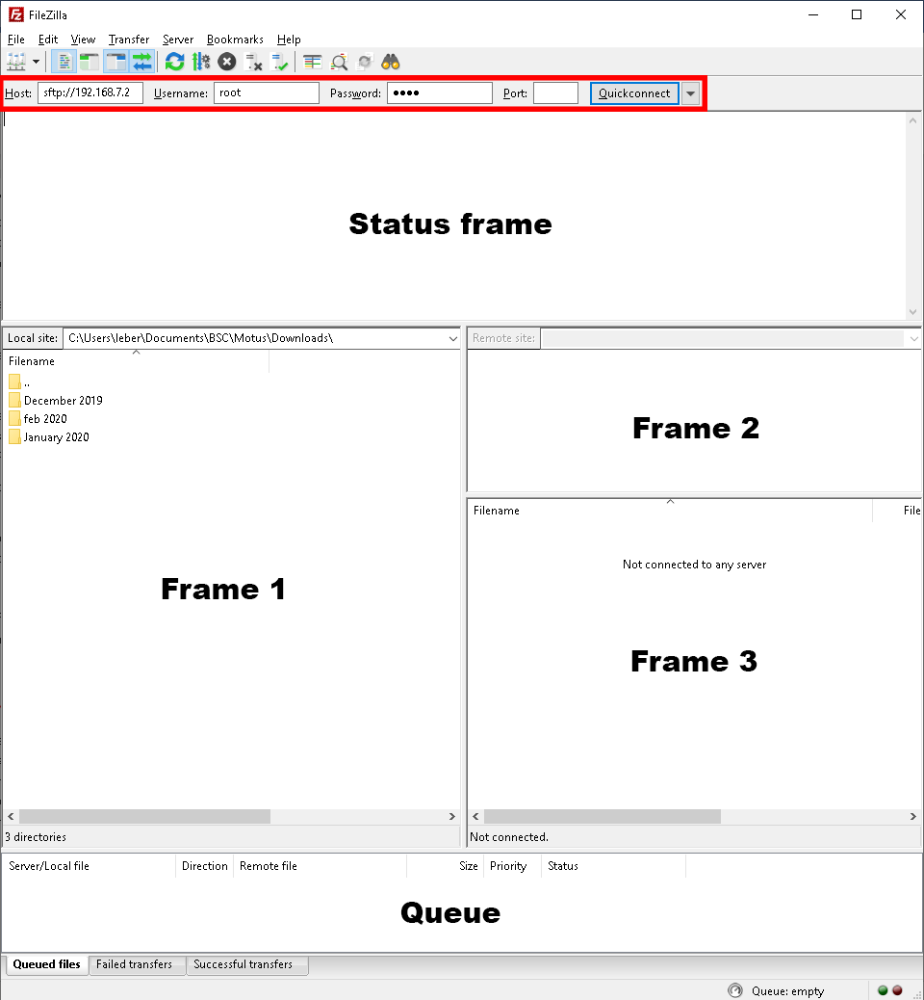

#. Download FileZilla from their website:
#. Install the program with its default settings
#. Open the program and in the top bar you will see four text fields labelled Host, Username, Password, and Port.
#. In the 'Host' field, enter the address "sftp://192.168.7.2" if you are connected via Wi-Fi. If you are connected by an Ethernet cable, enter the address "sftp://sgpi.local"
..images:: images/network-txt_screencap_raw.png
#. For the username enter "root" and for the password enter "root" as well. The port field should be left blank.
#. Click the 'Quickconnect' button and you should see the following progress text in the Status frame.
#. The folders visible on the left-hand side of the window are on your laptop ('Local Site') – we will call this sections frame 1. After clicking the 'Quickconnect' button, you should also see folders appear in two frames located on the right-hand side of the window – this is the internal storage of your SensorGnome ('Remote Site'). We will call the top and bottom sections frame 2 and frame 3, respectively.
#. To navigate through your SensorGnome's storage, you can use either of frames 2 or 3 but note only frame 3 shows files (frame 2 is for navigation only!).
#. Navigate to the 'root' of the Sensorgnome, either by clicking on the folder '/' in frame 2 or by clicking the '..' folder in frame 3 until you can no longer navigate further.
#. From this location, navigate to the following folder: “boot” / “uboot”.
#. In here you can find a file called 'network.txt'. Right click on it and select 'view/edit'.
#. This file contains all the instructions required to enter the Wi-Fi settings. Once completed, save and close the file.
#. To make the changes come into effect, you will need to reboot your SensorGnome.
#. Once rebooted, review that your SensorGnome has been connected successfully by searching for its serial number in the list of receivers found on http://sensorgnome.org/status.

Change Wi-Fi Settings - OPTION 2: **Android Smartphone**
--------------------------------------------------

#. Download and install **ES File Explorer** from the Google Play Store:

#. Open the program and open the top-left menu.
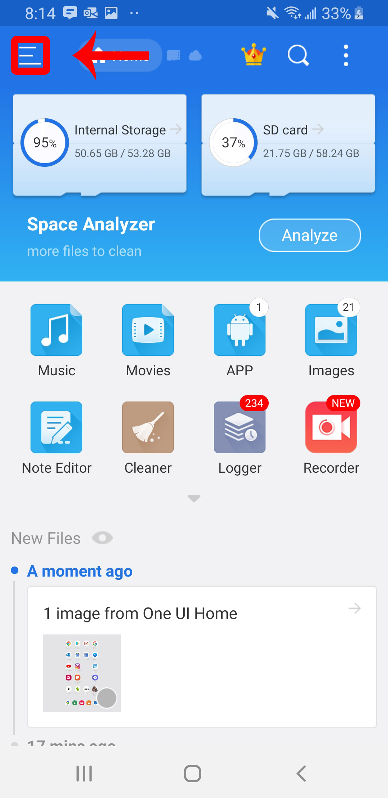

#. Select **Network** and then **FTP**.
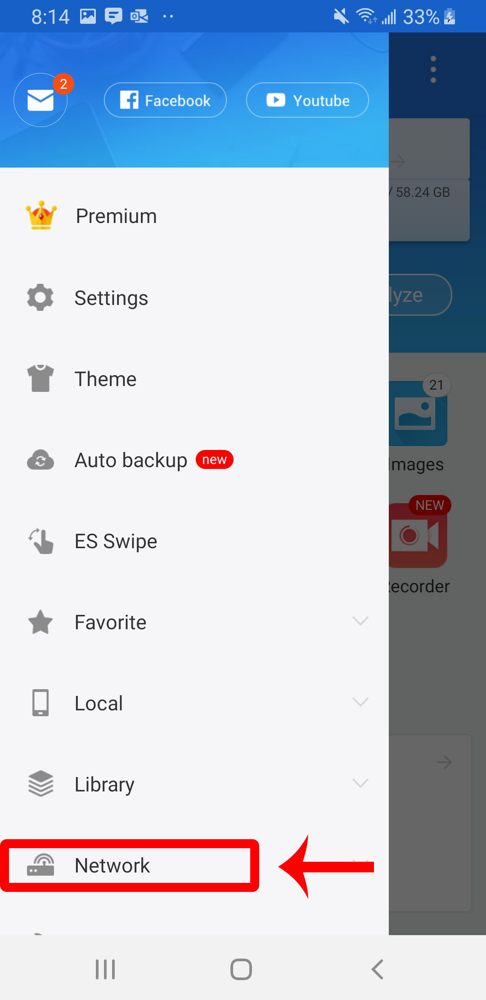
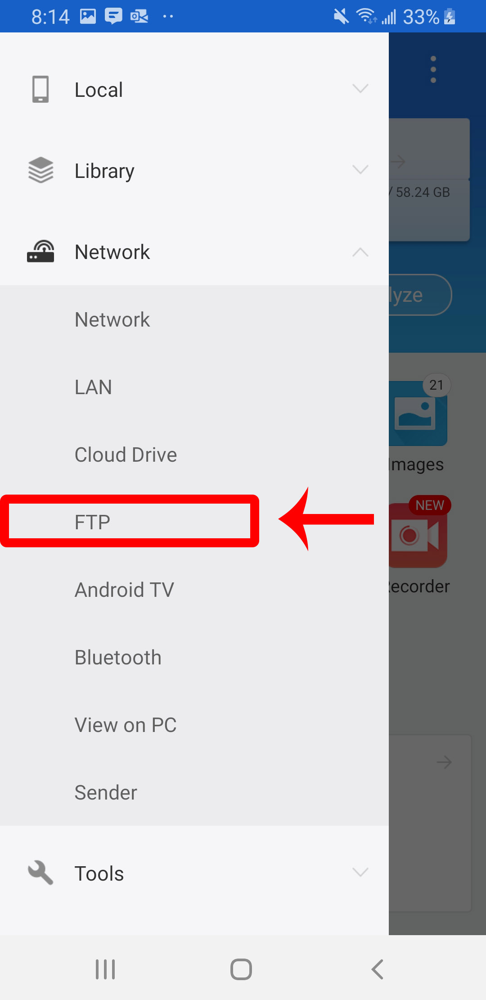

#. Open the folder '**192.168.7.2**'
		* If prompted for a username and password, enter '**root**' for both.
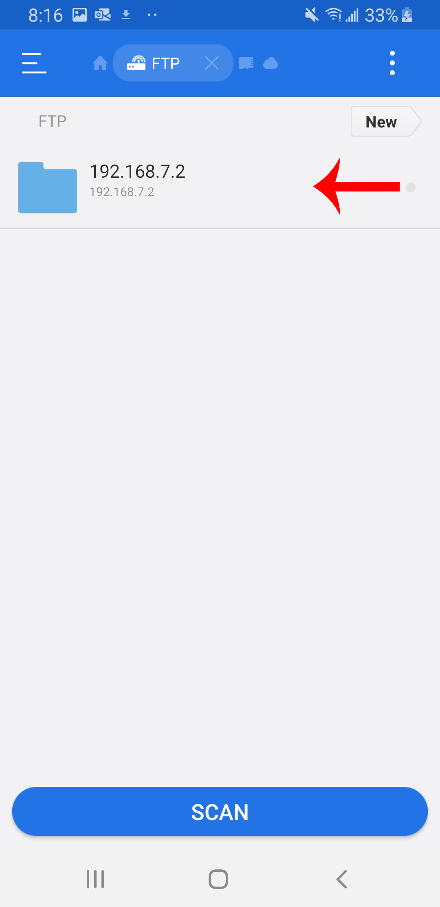

#. Scroll down until you see the '**boot**' folder and open it.
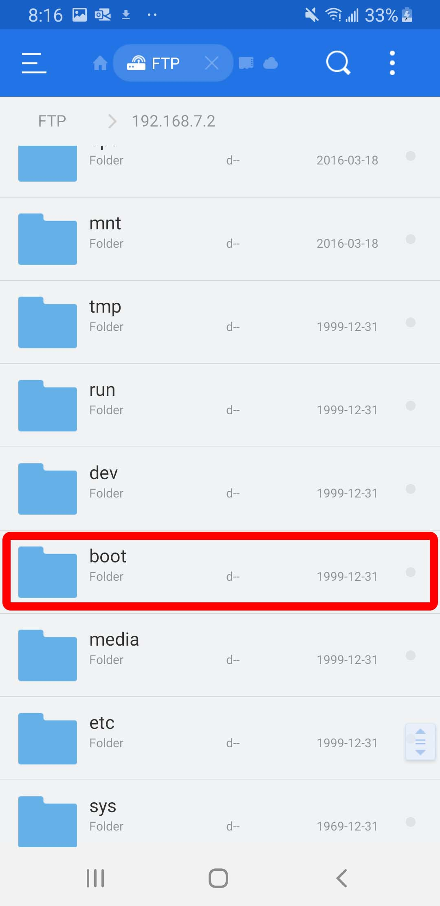

#. Open the '**uboot**' folder and then open the file named '**network.txt**'.
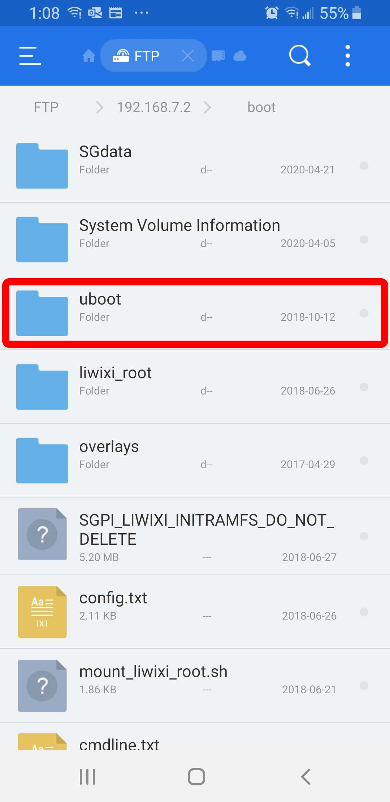
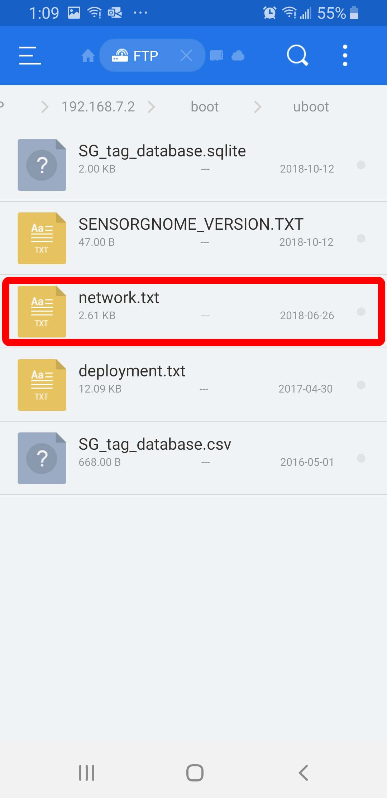

#. Open the menu on the **top-right** corner and select **Edit**.
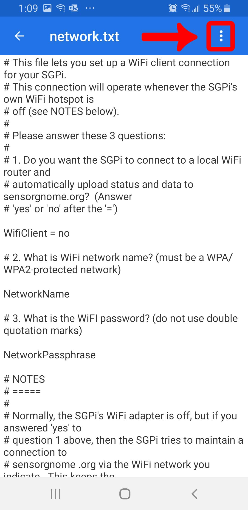
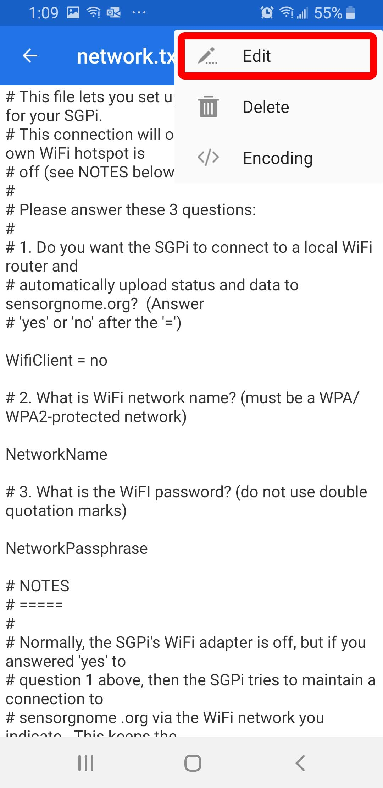

#. Read the instructions and edit the three lines of text as indicated.
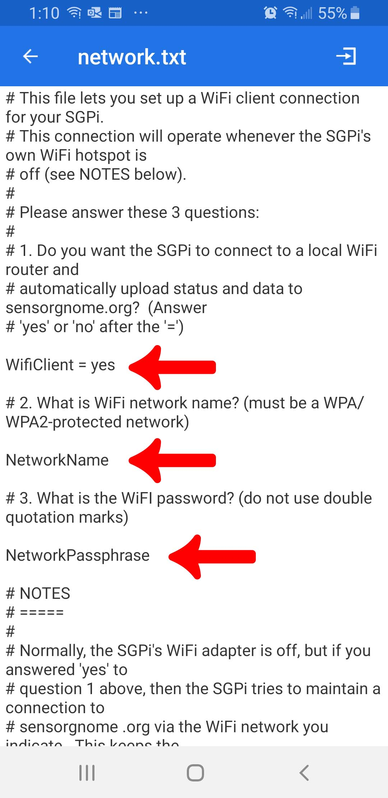

#. When all the correct information has beeen entered, press the back arrow on the top-left corner and confirm your edits.
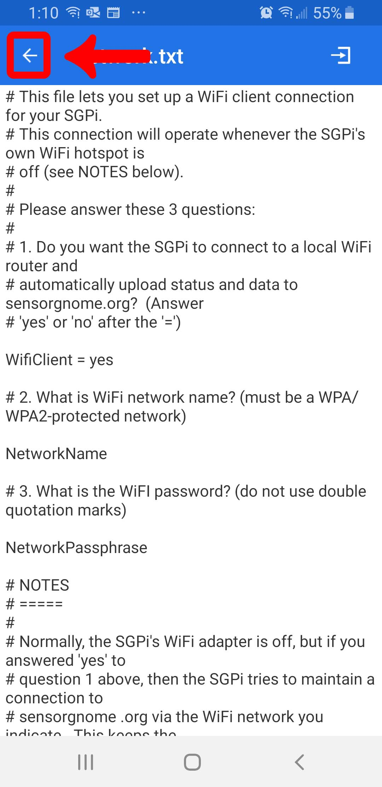

#. To make the changes come into effect, you will need to reboot your SensorGnome.

#. Once rebooted, review that your SensorGnome has been connected successfully by searching for its serial number in the list of receivers found on http://sensorgnome.org/status.

