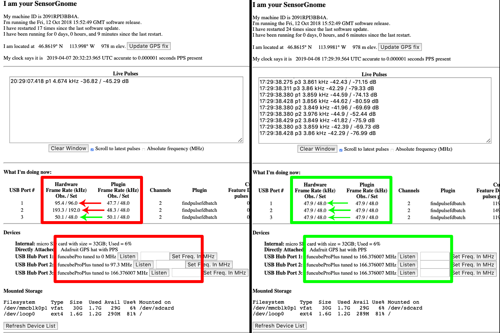

*********************************************
How to update the FUNcube Dongle Firmware
*********************************************

.. image:: images/finished_sg.jpg
  :alt: A finished Sensorgnome, ready to be deployed.

Introduction
============

FUNcube Dongles are a component used in `SensorGnomes <https://sensorgnome.org/>` and `CTT SensorStations<https://celltracktech.com/>` for listening to tags developed by `Lotek Wireless <https://lotek.com/>`. They were originally developed as a teaching tool for satellite communications and have been repurposed for many custom radio projects.

The firmware loaded onto the FUNcube Dongles by default is incompatible with the Sensorgnome software. Differences in hardware and plugin frame rates result in odd behaviour that often goes oncaught. Sometimes it will take a minute or two before this can be seen on the SensorGnome Web Interface. The image below shows FUNcubes with the wrong firmware tuned to the incorrect frequency.

Here I will explain how to correct this problem by reimaging the FUNcube dongle.

This guide is a simplified form of `the guide provided on the FUNcubed dongle website <http://www.funcubedongle.com/MyImages/FCDFirmwareUpdateGuide.pdf>`.
it

======================

Supplies
--------
 * FUNcube Dongle Pro Plus

Downloads
--------
 * `FUNcube Bootloader <http://www.funcubedongle.com/MyImages/FCHIDBL2.001.zip>`
 * `FUNcube Firmware <http://www.funcubedongle.com/MyImages/FCD2.20.03.48.pro.bin>`
 

Steps
---------------------------------------
#. Plug the FUNcube into your computer.
#. Open the FUNcube Bootloader executable ('.exe') you downloaded.
#. Click 'Open File' and navigate to the FUNcube Firmware you downloaded.
#. Click 'Write Firmware'. This should take 20-30 seconds.
#. Once the write is complete you will see the text 'Firmware Verified'. 
#. You may now remove the device from your computer and try it on your SensorGnome.
